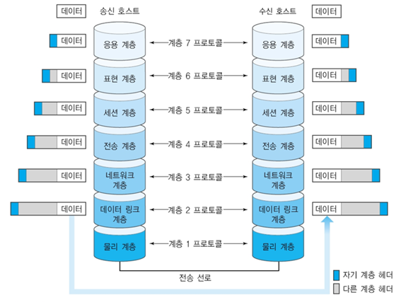

# Computer Network Basic
##### - OSI Reference Model, TCP/IP Model 동작 원리 ~ 네트워크 프로토콜 작동원리에 대한 분석 -

## INDEX

|Index|contents| |pages|
|:---:|:---:|:---:|:---:|
|1|기본 지식|------|1 - 4|
||
|2|OSI Reference Model|------|5 - 46|
|2-1|OSI 개요|------|5 - 9|
|2-2|Physical Layer [L1]|------|10 - 15|
|2-3|DataLink Layer [L2]|------|16 - 32|
|2-4|Network Layer [L3]|------|33 - 41|
|2-5|Transport Layer [L4]|------|42 - 46|
||
|3|TCP/IP Model|------|47 - 65|
|3-1|IP Layer|------|47 - 54|
|3-2|TCP Layer|------|55 - 65|
||
|4|Network Security|------|66 - 74|
|4-1|Security 개요|------|66|
|4-2|Cryptography (암호학)|------|66 - 74|
||
|5|HTTP Protocol|------|75 - 80|
||
|6|Wireless Network|------|81 - 88|
|6-1|Wireless LAN|------|81 - 88|
|6-2|Wireless PAN|------|88|
||
|7|정오표|------|89|

### What is in?
##### example img

**Download** : [computer-network](../../assets/ftp-files/Computer-Network.pdf)
